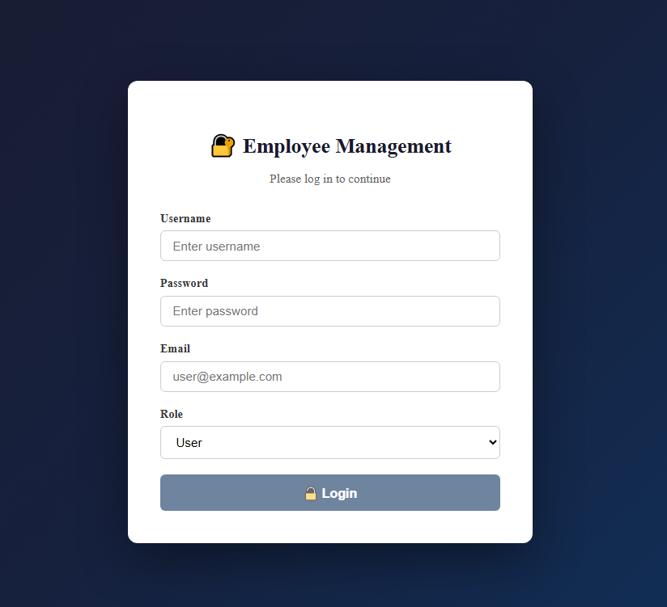
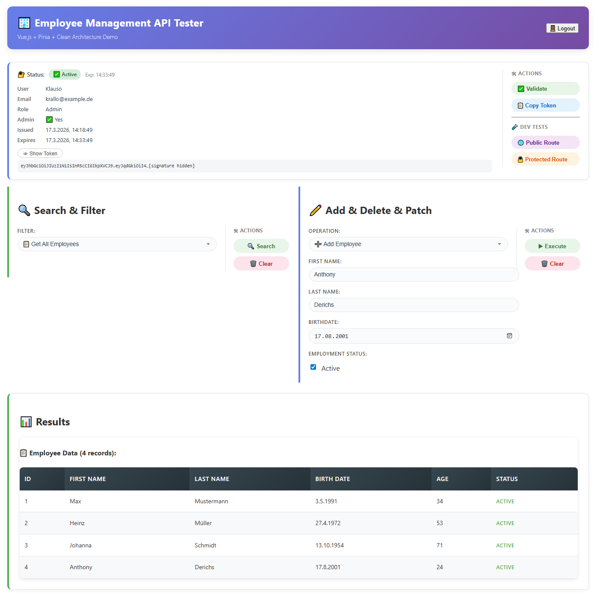

# 🏢 Employee Management – Full Stack Demo

A full-stack **Employee Management** application built with **.NET 9 Web API** (backend) and **Vue.js 3** (frontend), demonstrating JWT authentication, Clean Architecture, and a modern reactive UI.

---

## 📦 Repository Structure

```
WebAPI_Net9ASP-Mitarbeiterverwaltung/
├── WebAPI_NET9/       # ASP.NET Core – Controllers, Program.cs
├── Application/       # Business Logic – Services, Interfaces
├── Data/              # Infrastructure – Repositories, SQL
├── Domain/            # Core – Entities (Employee, OperationResult)
├── Tests/             # NUnit Unit Tests (37 Tests)
└── frontend/          # Vue.js 3 SPA
    └── src/
        ├── components/   # AuthSection, SearchSection, ChangeSection, LoginForm, EmployeeCard ...
        ├── stores/       # Pinia – authStore, employeeStore
        ├── services/     # Axios API client
        └── styles/       # Per-component CSS files
```

---

## 🖥️ Frontend – Vue.js 3

<table>
  <tr>
    <td align="center" width="40%">
      <b>Login</b><br/>
      
    </td>
    <td align="center" width="60%">
      <b>Employee Dashboard</b><br/>
      
    </td>
  </tr>
</table>

### Frontend Features

| Feature | Details |
|---|---|
| **Login Gate** | `LoginForm.vue` – JWT token creation before app access |
| **JWT Token Info** | Decoded payload: user, role, admin, issued, expiry |
| **Token Toggle** | Masked preview + Show/Hide raw JWT |
| **Search & Filter** | All · By ID · By last name · Active only · By birth date |
| **Employee CRUD** | Add · Delete · Patch via REST API |
| **Results Display** | Card grid with `EmployeeCard` + expandable `EmployeeDetails` |
| **Route Testing** | One-click test for public and protected API endpoints |
| **Responsive Layout** | Side-by-side sections on desktop, stacked on mobile |
| **Pinia State** | `authStore` (token, login, logout) + `employeeStore` (CRUD, search) |
| **Scoped CSS** | Per-component CSS files, pill-style buttons, gradient header |

### Frontend Tech Stack

| Technology | Purpose |
|---|---|
| Vue.js 3 (`script setup`) | UI Framework |
| Pinia | State Management |
| Axios | HTTP Client |
| Vue CLI 5 | Build Tool |

### Frontend Quick Start

```bash
cd frontend
npm install
npm run serve        # http://localhost:8080
```

> The backend must be running on `http://localhost:5100` (CORS is pre-configured).

---

## ⚙️ Backend – .NET 9 Web API

**Request Flow**

```
HTTP Request
     |
     v
Controller  (WebAPI_NET9)
     |  OperationResult<T>
     v
IEmployeeService  (Application Layer)
     |  Business Logic + Validation
     v
IEmployeeRepository  (Data Layer)
     |  Dapper + MySQL + async/await
     v
MySQL Database  <--  Connection Factory (1-3 ms/request)
```

### Backend Features

| Feature | Details |
|---|---|
| **JWT Authentication** | Custom claims · role-based access · `admin` claim controls write access |
| **Clean Architecture** | Domain / Application / Data / Presentation separation |
| **OperationResult Pattern** | Typed results without exceptions for control flow |
| **Async/Await** | All endpoints and DB operations fully async |
| **CancellationToken** | Graceful request cancellation on all endpoints |
| **MySQL + Dapper** | Micro-ORM, thread-safe connection factory (1–3 ms/request) |
| **OpenTelemetry OTLP** | Structured logging + traces (Seq / Jaeger compatible) |
| **Health Checks** | `/health` · `/health/ready` · `/health/live` (Kubernetes-ready) |
| **Swagger/OpenAPI** | Full JWT-authenticated Swagger UI |
| **Unit Tests** | 37 NUnit tests covering all layers (NSubstitute mocks) |
| **Startup Validation** | Config checked at startup – fails fast if misconfigured |
| **MySQL Exception Handling** | Granular error handling for DB-specific errors |
| **JSON Source Generation** | `System.Text.Json` AOT-ready serialization |
| **CORS** | Pre-configured for `localhost:8080` (Vue dev server) |

### API Endpoints

#### Authentication

| Method | Endpoint | Auth | Description |
|---|---|---|---|
| `POST` | `/api/auth/token` | — | Generate JWT token |
| `GET` | `/api/auth/public` | — | Public test endpoint |
| `GET` | `/api/auth/protected` | JWT | Protected test endpoint |

#### Employee Management

| Method | Endpoint | Auth | Description |
|---|---|---|---|
| `GET` | `/api/employees` | Public | Get all employees |
| `GET` | `/api/employees/{id}` | JWT | Get by ID |
| `GET` | `/api/employees/search?search=LastName` | JWT | Search by last name |
| `GET` | `/api/employees/search?search=isActive` | JWT | Get active only |
| `GET` | `/api/employees/birthDate?birthDate=YYYY-MM-DD` | JWT | Older than date |
| `POST` | `/api/employees` | Admin | Create employee |
| `PATCH` | `/api/employees/{id}` | Admin | Update employee |
| `DELETE` | `/api/employees/{id}` | Admin | Delete employee |

#### Response Format

```json
{
  "message": "New employee created successfully",
  "data": {
    "id": 1,
    "firstName": "Max",
    "lastName": "Mustermann",
    "birthDate": "1990-05-15",
    "isActive": true
  }
}
```

### Backend Tech Stack

| Technology | Version | Purpose |
|---|---|---|
| .NET / ASP.NET Core | 9.0 | Web API Framework |
| MySQL | Latest | Database |
| Dapper | 2.1.66 | Micro-ORM |
| JWT Bearer | Latest | Authentication |
| OpenTelemetry | Latest | Observability |
| Swagger | 9.0.4 | API Documentation |
| NUnit + NSubstitute | Latest | Testing |

---

## 🚀 Quick Start

### Option A – Docker (recommended)

**Prerequisites:** [Docker Desktop](https://www.docker.com/products/docker-desktop/)

```bash
git clone https://github.com/KlausSchmidtAC/WebAPI_Net9ASP-Mitarbeiterverwaltung.git
cd WebAPI_Net9ASP-Mitarbeiterverwaltung

docker-compose up --build
```

All services start automatically in the correct order:

| Service | URL | Description |
|---|---|---|
| Backend API | `http://localhost:5100` | ASP.NET Core Web API |
| Seq Logs UI | `http://localhost:8081` | Structured logs (Login: `admin` / `Admin2026!`) |
| MySQL | `localhost:3307` | Accessible from host (e.g. MySQL Workbench) |

> The database and tables are **created automatically** on first start.

```bash
docker-compose down        # stop all containers
docker-compose down -v     # stop containers + delete volumes (DB data)
```

---

### Option B – Local Development

**Prerequisites:**
- [.NET 9 SDK](https://dotnet.microsoft.com/download)
- [Node.js 18+](https://nodejs.org/)
- MySQL Server running locally
- Seq running locally on `localhost:5099`

#### 1. Backend

```bash
git clone https://github.com/KlausSchmidtAC/WebAPI_Net9ASP-Mitarbeiterverwaltung.git
cd WebAPI_Net9ASP-Mitarbeiterverwaltung
dotnet restore

cd WebAPI_NET9
dotnet run
# API:     http://localhost:5100
# Swagger: https://localhost:5101/swagger
# Health:  http://localhost:5100/health
```

Configure `WebAPI_NET9/appsettings.Development.json`:
```json
{
  "Database": {
    "ServerIP": "localhost",
    "DatabaseName": "employees",
    "Port": "3306",
    "Username": "webapi_user",
    "Password": "your_password"
  }
}
```

#### 2. Frontend

```bash
cd frontend
npm install
npm run serve
# App: http://localhost:8080
```

> The frontend communicates with the backend on `http://localhost:5100` – regardless of whether Option A or B is used.

---

## 🐳 Docker Architecture

```
                    ┌─────────────────────────────────────┐
                    │         Docker Network              │
                    │                                     │
Browser/k6          │  ┌──────────┐    ┌──────────────┐  │
localhost:5100 ─────┼─►│ backend  │───►│    mysql     │  │
localhost:8081 ─────┼─►│  :5100   │    │    :3306     │  │
localhost:3307 ─────┼─►│          │    └──────────────┘  │
                    │  │          │    ┌──────────────┐  │
                    │  │          │───►│     seq      │  │
                    │  └──────────┘    │  :5341/:80   │  │
                    │                  └──────────────┘  │
                    └─────────────────────────────────────┘
```

### Docker Services

| Service | Image | Internal Port | Host Port |
|---|---|---|---|
| `backend` | `webapi-backend:latest` (built locally) | `5100` | `5100` |
| `mysql` | `mysql:8.0` | `3306` | `3307` |
| `seq` | `datalust/seq:latest` | `5341` (OTLP), `80` (UI) | `5341`, `8081` |

### Startup Order (automatic via `depends_on`)

```
mysql (healthy) ──┐
                  ├──► backend starts
seq (started)  ──┘
```

---

## 🔍 Health Monitoring

```bash
curl http://localhost:5100/health        # Overall status (App + DB)
curl http://localhost:5100/health/ready  # Kubernetes readiness probe (DB only)
curl http://localhost:5100/health/live   # Kubernetes liveness probe (App only)
```

---

## ⚠️ Security Notice – Demo Mode

> **This project has no real password validation.**
> `POST /api/auth/token` returns a valid JWT for **any credentials**.
> The `admin` CustomClaim (set via Role selection in the frontend) controls write access.
>
> **Missing for production:**
> - User database with stored credentials
> - Password hashing (e.g. BCrypt)
> - Server-side role validation before token issuance

---

## 🧪 Running Tests

```bash
dotnet test
# 37 tests · NUnit + NSubstitute · all layers covered
```

---

⭐ **Star this repo if it helped you!**

🔧 **Built with .NET 9 · Vue.js 3 · JWT · OpenTelemetry · Clean Architecture**